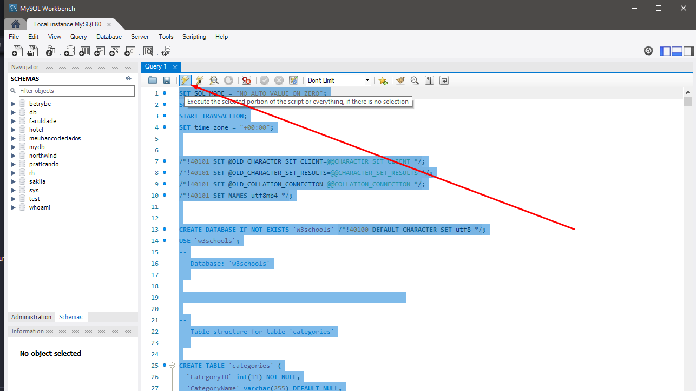
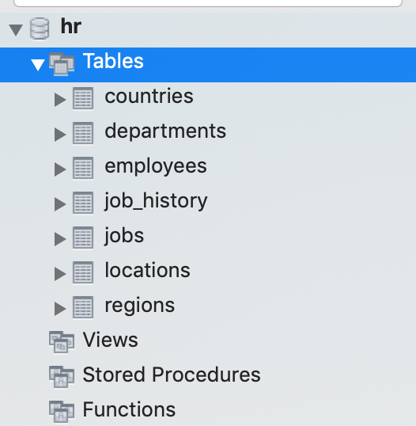

# Habilidades

Neste projeto, verificamos se voce é capaz de:

  * Criar condicionais no **SQL** usando **IF** e **CASE**

  * Manipular _strings_ no **SQL**

  * Usar as diversas funções matemáticas do **MySQL**

  * Extrair informações específicas sobre datas de uma tabela

  * Utilizar as funções de agregação **AVG**, **MIN**, **MAX**, **SUM** e **COUNT**

  * Exibir e filtrar dados de forma agrupada com **GROUP BY** e **HAVING**

  * Utilizar **INNER JOIN**, **LEFT JOIN**, **RIGHT JOIN** para combinar dados de duas ou mais tabelas

  * Utilizar **SELF JOIN** para fazer join de uma tabela com ela própria

  * Utilizar SUBQUERIES

  * Criar queries mais eficientes através do EXISTS

  * Montar blocos de código **SQL** reutilizáveis com **STORED PROCEDURES** e **STORED FUNCTIONS**

---

## Instruções para restaurar os bancos de dados `w3schools` e `hr`

1. Faça o download dos arquivos de backup [aqui](w3schools.sql) e [aqui](hr.sql) clicando em "Raw", depois clicando com botão direito e selecionando "Salvar como" para salvar os arquivos em seu computador.

2. Abra o MySQL Workbench.

3. Abra uma nova janela de query e cole dentro dela todo o conteúdo do arquivo `w3schools.sql`.

4. Selecione todo o código com o atalho `CTRL-A` e clique no ícone de trovão para executar o script.

    

5. Aguarde alguns segundos (espere em torno de 30 segundos antes de tentar fazer algo).

6. Clique no botão apontado na imagem a seguir para atualizar a listagem de banco de dados:

    

7. Verifique se o banco restaurado possui todas as seguintes tabelas:

    

8. Clique com botão direito em cada tabela e selecione "Select Rows". Certifique-se de que todas as tabelas possuem registros. Se alguma estiver vazia ou ausente, faça o passo a seguir. Caso contrário, vá direto para o passo 10.

9. Caso haja tabelas faltando, delete o banco de dados clicando com o botão direito em cima do banco de dados `w3schools` e selecione a opção `Drop Schema...`. Refaça os passos anteriores, desta vez aguardando um tempo maior quando executar o script de restauração.

    

10. O mesmo processo mencionado anteriormente também deve ser feito para restaurar o banco `hr`. Verifique se o banco `hr` restaurado possui todas as tabelas indicadas na imagem abaixo. Se alguma estiver vazia ou ausente, faça o passo a seguir. Caso contrário, vá direto para a próxima seção.

    

11. Caso haja tabelas faltando, delete o banco de dados clicando com o botão direito em cima do banco de dados `hr` e selecione a opção `Drop Schema...`. Refaça o passo anterior, desta vez aguardando um tempo maior quando executar o script de restauração.

---

## Implementações técnicas

Para executar localmente os testes, é preciso escrever o seguinte no seu terminal:
```sh
MYSQL_USER=<SEU_NOME_DE_PESSOA_USUARIA> MYSQL_PASSWORD=<SUA SENHA> HOSTNAME=<NOME_DO_HOST> npm test
```

Ou seja, suponha que para poder acessar a base de dados feita neste projeto você tenha `root` como seu nome de pessoa usuária, `password` como senha e `localhost` como host. Logo, você executaria:
```sh
MYSQL_USER=root MYSQL_PASSWORD=password HOSTNAME=localhost npm test
```

Usando o exemplo anterior de base, suponha que você não tenha setado uma senha para `root`. Neste caso, você executaria:
```sh
MYSQL_USER=root MYSQL_PASSWORD= HOSTNAME=localhost npm test
```
---

:warning: **Não é necessário colocar** `USE NAMEDATABASE;` ou `SET SQL_SAFE_UPDATES = 0;` no início dos seus arquivos :warning:

---

# Requisitos do projeto

## 1 - Exiba os países e indicando se cada um deles se encontra ou não na região formada pela Europa

Crie uma query que mostre se o país pertence ou não à região `"Europe"`.

> Use o banco `hr` como referência 

Seu relatório deve apresentar 02 colunas:

1. A primeira deve possuir o alias "**País**" e exibir o nome do país.

2. A segunda deve possuir o alias "**Status Inclusão**" e deve exibir `"incluído"` se o país em questão está incluso em `"Europe"`, ou `"não incluído"`, caso contrário.

Os resultados devem estar ordenados pelo nome do país em ordem alfabética.

---

## 2 - Exiba os cargos com seu nível de renumeração associado, com base no salário máximo do cargo

Categorize o nível de remuneração de cada cargo.

> Use o banco `hr` como referência 

Seu relatório deve possuir as seguintes colunas:

1. A primeira deve possuir o alias "**Cargo**" e exibir o nome do cargo.

2. A segunda deve possuir o alias "**Nível**" e exibir o nível de remuneração do cargo com base no seu **salário máximo**, categorizando os níveis de remuneração da seguinte forma:

    Salário máximo entre 5000 e 10000 :arrow_right: Baixo

    Salário máximo entre 10001 e 20000 :arrow_right: Médio

    Salário máximo entre 20001 e 30000 :arrow_right: Alto

    Salário máximo acima de 30000 :arrow_right: Altíssimo

Os resultados devem estar ordenados pelo nome do cargo em ordem alfabética.

---

## 3 - Exiba os cargos com a diferença entre seus salários máximo e mínimo

Crie uma query que exiba 02 colunas:

> Use o banco `hr` como referência 

1. A primeira deve possuir o alias "**Cargo**" e exibir o nome do cargo.

2. A segunda deve possuir o alias "**Diferença entre salários máximo e mínimo**" e exibir a diferença entre os salários máximo e mínimo para o cargo em questão.

Os resultados devem estar ordenados pela diferença entre salários máximo e mínimo em ordem crescente.

Em caso de empate nessa diferença os resultados devem ser ordenados pelo nome do cargo em ordem alfabética.

---

## 4 - Exiba a média salarial e o nível de senioridade de todas as pessoas empregadas, agrupadas pelo cargo

Obtenha informações a respeito **dos salários das pessoas empregadas**.

> Use o banco `hr` como referência

Crie uma query que exiba 03 colunas:

1. A primeira deve possuir o alias "**Cargo**" e exibir o nome do cargo.

2. A segunda deve possuir o alias "**Média salarial**" e exibir a média dos salários das pessoas empregadas que possuem o cargo em questão.

3. A terceira deve possuir o alias "**Senioridade**" e categorizar o nível de senioridade do cargo com base na média salarial, da seguinte forma:

    Média salarial entre 2000 - 5800 :arrow_right: Júnior

    Média salarial entre 5801 - 7500 :arrow_right: Pleno

    Média salarial entre 7501 - 10500 :arrow_right: Sênior

    Média salarial acima de 10500 :arrow_right: CEO

Sempre que fizer uso da média salarial, arredonde o valor para 02 casas decimais.

Os resultados devem estar ordenados pela média salarial em ordem crescente.

Em caso de empate na média, os resultados devem ser ordenados pelo nome do cargo em ordem alfabética.

---

## 5 - Exiba os cargos com sua variação salarial e suas médias máxima e mínima mensal, considerando salários máximo e minímo como anuais

⚠️ Considere os salários máximo e mínimo de um cargo como salários anuais. ⚠️

> Use o banco `hr` como referência

Crie uma query que exiba 04 colunas:

1. A primeira deve possuir o alias "**Cargo**" e exibir o nome do cargo.

2. A segunda deve possuir o alias "**Variação Salarial**" e exibir a diferença entre os salários máximo e mínimo daquele cargo.

3. A terceira deve possuir o alias "**Média mínima mensal**" e exibir o salário mínimo **mensal** daquele cargo. Arredonde a média com uma precisão de duas casas decimais.

4. A quarta deve possuir o alias "**Média máxima mensal**" e exibir o salário máximo **mensal** daquele cargo. Arredonde a média com uma precisão de duas casas decimais.

Os resultados devem estar ordenados pela variação salarial em ordem crescente.

Em caso de empate na variação, os resultados devem ser ordenados pelo nome do cargo em ordem alfabética.

---

## 6 - Faça um relatório que mostra o histórico de cargos das pessoas empregadas

Faça um relatório que mostra o **histórico de cargos das pessoas empregadas**. 

> Use o banco `hr` como referência 

Monte uma query que exiba 04 colunas:

1. A primeira deve possuir o alias "**Nome completo**" e exibir o **nome completo** da pessoa empregada (não se esqueça do espaço entre o nome e o sobrenome).

2. A segunda deve possuir o alias "**Cargo**" e exibir o nome do cargo da pessoa.

3. A terceira deve possuir o alias "**Data de início do cargo**" e exibir a data que a pessoa iniciou o cargo.

4. A quarta deve possuir o alias "**Departamento**" e mostrar o nome do departamento em que a pessoa exerceu seu cargo.

Os resultados devem estar ordenados pelo nome completo das pessoas empregadas em ordem decrescente.

Em caso de empate no nome completo, ordene os resultados pelo nome do cargo em ordem alfabética.

---

## 7 - Faça um relatório que mostra o histórico de cargos das pessoas empregadas que iniciaram seus cargos nos meses de janeiro, fevereiro ou março

Faça um relatório que mostre o **histórico de cargos das pessoas empregadas** que iniciaram seus cargos nos meses de janeiro, fevereiro ou março.

> Use o banco `hr` como referência

Monte uma query que exiba 03 colunas:

1. A primeira deve possuir o alias "**Nome completo**" e exibir o **nome completo** da pessoa empregada em CAIXA ALTA (não se esqueça do espaço entre o nome e o sobrenome).

2. A segunda deve possuir o alias "**Data de início**" e exibir a data que a pessoa iniciou o cargo.

3. A terceira deve possuir o alias "**Salário**" e exibir o salário da pessoa.

Os resultados devem estar ordenados pelo nome completo das pessoas empregadas em ordem alfabética.

Em caso de empate no nome completo, ordene os resultados pela data de início que a pessoa iniciou seu cargo, em ordem crescente.

---

## 8 - Exibe todas as **pessoas consumidoras** cujos pedidos já foram enviados pelas empresas `"Speedy Express"` ou `"United Package"`

Exiba todas as **pessoas consumidoras** cujos pedidos já foram enviados pelas empresas `"Speedy Express"` ou `"United Package"`.

> Use o banco `w3schools` como referência

Monte uma query que exiba 03 colunas:

1. A primeira deve possuir o alias "**Nome de contato**" e exibir **o nome de contato** da pessoa consumidora.

2. A segunda deve possuir o alias "**Empresa que fez o envio**" e exibir o nome da empresa que efetuou o envio do pedido.

3. A terceira deve possuir o alias "**Data do pedido**" e exibir a data que o pedido foi feito.

Seus resultados devem estar ordenados pelo nome de contato da pessoa consumidora em ordem alfabética.

Em caso de empate no nome de contato, ordene os resultados pelo nome da empresa que fez o envio do produto em ordem alfabética.

Se houver empresas com o mesmo nome, ordene os resultados pela data do pedido em ordem crescente.

---

## 9 - Exibe todos as pessoas funcionárias que já realizaram algum pedido, mostrando também seu total de pedidos feitos

Exiba todas as pessoas funcionárias que já realizaram algum pedido e o total dos pedidos feitos.

> Use o banco `w3schools` como referência

Monte uma query que exiba 02 colunas:

1. A primeira deve possuir o alias "**Nome completo**" e exibir o nome completo da pessoa funcionária (não se esqueça do espaço entre o nome e o sobrenome).

2. A segunda deve possuir o alias "**Total de pedidos**" e exibir a quantidade total de pedidos feitos pela pessoa.

Ordene seus resultados pelo total de pedidos em ordem crescente.

---

## 10 - Exibe todos os produtos que já foram pedidos, que possuem uma média de quantidade nos pedidos registrados acima de `20.00`

Exiba todos os produtos que já foram pedidos e que possuem uma média de quantidade nos pedidos registrados acima de `20.00`.

> Use o banco `w3schools` como referência

Monte uma query que exiba 04 colunas:

1. A primeira deve possuir o alias "**Produto**" e exibir o nome do produto.

2. A segunda deve possuir o alias "**Mínima**" e exibir a **quantidade mínima** que já foi pedida desse produto.

3. A terceira deve possuir o alias "**Máxima**" e exibir a **quantidade máxima** que já foi pedida desse produto.

4. A quarta deve deve possuir o alias "**Média**" e exibir a **média de quantidade nos pedidos** deste produto, arredondada para duas casas decimais.

Os resultados devem estar ordenados pela média de quantidade nos pedidos em ordem crescente.

Em caso de empate na média, os resultados devem ser ordenados pelo nome do produto em ordem alfabética.

---

## 11 - Exibe todas as pessoas clientes **que possuem compatriotas**, mostrando a quantidade de compatriotas para cada pessoa cliente

Exiba todas as pessoas clientes **que possuem compatriotas**.

> Use o banco `w3schools` como referência

Mostre a quantidade de compatriotas para cada pessoa cliente.

Suponha que haja apenas 04 clientes:

1. `Maria`, do `Brasil`.

2. `João`, do `Brasil`.

3. `Gabriela`, do `Brasil`.

4. `Alex`, da `Irlanda`.

Logo, podemos dizer que `Maria`, `João` e `Gabriela` são compatriotas entre si, haja visto que as três pessoas moram no `Brasil`. Além disso, podemos dizer que tanto `Maria` quanto `João` e `Gabriela` possuem duas pessoas compatriotas associadas. Já `Alex` não possui compatriota, haja visto que não há outras pessoas da `Irlanda`.

Monte uma query que exiba 03 colunas:

1. A primeira deve possuir o alias "**Nome**" e exibir **o nome de contato** da pessoa cliente.

2. A segunda deve possuir o alias "**País**" e exibir o nome do país em que a pessoa reside.

3. A terceira deve possuir o alias "**Número de compatriotas**" e exibir o número de pessoas que moram no mesmo país.

Os resultados devem estar ordenados pelo nome de contato da pessoa cliente em ordem alfabética.

---

## 12 - Faça um relatório que lista todas as pessoas funcionárias **que possuem o mesmo cargo**

Faça um relatório que lista todas as pessoas funcionárias **que possuem o mesmo cargo**.

> Use o banco `hr` como referência

Suponha que haja somente 03 pessoas funcionárias, `João`, `Maria` e `Alex`, e:

* `João` e `Maria` possuem o mesmo cargo;

* `Alex` não tem outra pessoa funcionária com o mesmo cargo.

Logo, podemos dizer que `João` tem uma pessoa funcionária associada, `Maria`, que possui o mesmo cargo. Também podemos dizer que `Maria` tem uma pessoa funcionária associada, `João`, que possui o mesmo cargo. Já `Alex` não tem outra pessoa funcionária associada com o mesmo cargo. Portanto, seu relatório deveria ter dois resultados, um indicando que `Maria` tem uma pessoa associada `João` que possui o mesmo cargo, e o outro resultado indicando que `João` tem uma pessoa associada `Maria` que possui o mesmo cargo.

Monte uma query que exiba 06 colunas:

1. A primeira deve possuir o alias "**Nome completo funcionário 1**" e exibir o **nome completo** da pessoa funcionária (não se esqueça do espaço entre o nome e o sobrenome).

2. A segunda deve possuir o alias "**Salário funcionário 1**" e exibir o salário dessa pessoa.

3. A terceira deve possuir o alias "**Telefone funcionário 1**" e exibir o número de telefone dessa pessoa.

4. A quarta deve possuir o alias "**Nome completo funcionário 2**" e exibir o **nome completo** da pessoa funcionária associada que possui o mesmo cargo (não se esqueça do espaço entre o nome e o sobrenome).

5. A quinta deve possuir o alias "**Salário funcionário 2**" e exibir o salário da pessoa funcionária associada que possui o mesmo cargo.

6. A sexta deve possuir o alias "**Telefone funcionário 2**" e exibir o número da pessoa funcionária associada que possui o mesmo cargo.

Os resultados devem estar ordenados pela coluna "**Nome completo funcionário 1**" em ordem alfabética.

Em caso de empate, os resultados devem ser ordenados pela coluna **Nome completo funcionário 2**" em ordem alfabética.

---

## 13 - Exibe todos produtos **que já tiveram um pedido associado requerindo uma quantidade desse produto maior que 80**

Exiba todos os produtos **que já tiveram um pedido associado requerindo uma quantidade desse produto maior que 80**. 

> Use o banco `w3schools` como referência

Monte uma query que exiba 02 colunas:

1. A primeira deve possuir o alias "**Produto**" e exibir o nome do produto.

2. A segunda deve possuir o alias "**Preço**" e exibir o preço desse produto.

Os resultados devem estar ordenados pelo nome do produto em ordem alfabética.

---

## 14 - Considerando o conjunto formado pelas pessoas consumidoras e empresas fornecedoras de produtos, queremos saber quais são os cinco primeiros países distintos, em ordem alfabética, presentes nesse conjunto

Exiba os 05 primeiros países distintos dentre as pessoas consumidoras e as empresas fornecedoras, em ordem alfabética.

> Use o banco `w3schools` como referência

Monte uma query que exiba 01 coluna com o alias "**País**" contendo o nome do país.

---

## 15 - Crie uma procedure chamada `buscar_media_por_cargo` que recebe como parâmetro o nome de um cargo e em retorno deve mostrar a média salarial de todas as pessoas que possuem esse cargo

Crie uma procedure chamada `buscar_media_por_cargo` que recebe como parâmetro o nome de um cargo e em retorno deve mostrar a média salarial de todas as pessoas que possuem esse cargo.

Sua procedure deve retornar somente 01 coluna com o alias "**Média salarial**", que mostra a média salarial arredondada para duas casas decimais.

> Use o banco `hr` como referência 

Confirme a execução correta da procedure chamando-a e passando o nome de cargo igual a `"Programmer"`:

`CALL buscar_media_por_cargo('Programmer');`

Chamando-a dessa forma, sua procedure deve retornar `5760.00` como média salarial para pessoas que ocupam o cargo `"Programmer"`.

---

## 16 - Crie uma função chamada `buscar_quantidade_de_empregos_por_funcionario` no banco de dados `hr` que, ao receber o **email de uma pessoa funcionária**, retorne a quantidade de empregos **presentes em seu histórico**

Crie uma função chamada `buscar_quantidade_de_empregos_por_funcionario` que, ao receber o **email de uma pessoa funcionária**, retorne a quantidade de empregos **presentes em seu histórico**.

> Use o banco `hr` como referência 

Confirme que sua função retorna o valor `2` ao ser chamada passando uma pessoa funcionária cujo email é `"NKOCHHAR"`.
